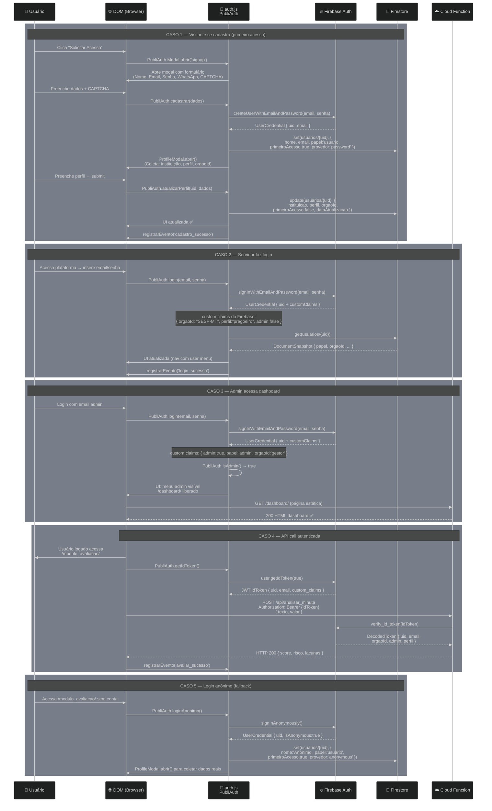

# Diagrama 02 — Fluxo de Autenticação

**Módulos:** `auth.js` (Frontend) + `Firebase Auth` + `Firestore usuarios/` + Custom Claims

```mermaid
%%{init: {'theme':'dark', 'themeVariables': {'primaryColor':'#1E293B','primaryTextColor':'#F1F5F9','primaryBorderColor':'#2EC4B6','lineColor':'#475569'}}}%%
sequenceDiagram
    participant USR as 👤 Usuário
    participant DOM as 🌐 DOM (Browser)
    participant AUTH_JS as 🔐 auth.js<br/>PubliAuth
    participant FBA as 🔥 Firebase Auth
    participant FS as 📄 Firestore
    participant CF as ☁️ Cloud Function

    rect rgba(30,41,59,0.6)
        Note over USR,FS: CASO 1 — Visitante se cadastra (primeiro acesso)
        USR->>DOM: Clica "Solicitar Acesso"
        DOM->>AUTH_JS: PubliAuth.Modal.abrir('signup')
        AUTH_JS->>DOM: Abre modal com formulário<br/>(Nome, Email, Senha, WhatsApp, CAPTCHA)
        USR->>DOM: Preenche dados + CAPTCHA
        DOM->>AUTH_JS: PubliAuth.cadastrar(dados)
        AUTH_JS->>FBA: createUserWithEmailAndPassword(email, senha)
        FBA-->>AUTH_JS: UserCredential { uid, email }
        AUTH_JS->>FS: set(usuarios/{uid}, {<br/>  nome, email, papel:'usuario',<br/>  primeiroAcesso:true, provedor:'password' })
        AUTH_JS->>DOM: ProfileModal.abrir()<br/>(Coleta: instituição, perfil, orgaoId)
        USR->>DOM: Preenche perfil → submit
        DOM->>AUTH_JS: PubliAuth.atualizarPerfil(uid, dados)
        AUTH_JS->>FS: update(usuarios/{uid}, {<br/>  instituicao, perfil, orgaoId,<br/>  primeiroAcesso:false, dataAtualizacao })
        AUTH_JS->>DOM: UI atualizada ✅
        AUTH_JS->>DOM: registrarEvento('cadastro_sucesso')
    end

    rect rgba(30,41,59,0.6)
        Note over USR,CF: CASO 2 — Servidor faz login
        USR->>DOM: Acessa plataforma → insere email/senha
        DOM->>AUTH_JS: PubliAuth.login(email, senha)
        AUTH_JS->>FBA: signInWithEmailAndPassword(email, senha)
        FBA-->>AUTH_JS: UserCredential { uid + customClaims }
        Note over AUTH_JS: custom claims do Firebase:<br/>{ orgaoId: "SESP-MT", perfil:"pregoeiro", admin:false }
        AUTH_JS->>FS: get(usuarios/{uid})
        FS-->>AUTH_JS: DocumentSnapshot { papel, orgaoId, ... }
        AUTH_JS->>DOM: UI atualizada (nav com user menu)
        AUTH_JS->>DOM: registrarEvento('login_sucesso')
    end

    rect rgba(30,41,59,0.6)
        Note over USR,CF: CASO 3 — Admin acessa dashboard
        USR->>DOM: Login com email admin
        DOM->>AUTH_JS: PubliAuth.login(email, senha)
        AUTH_JS->>FBA: signInWithEmailAndPassword(email, senha)
        FBA-->>AUTH_JS: UserCredential { uid + customClaims }
        Note over AUTH_JS: custom claims: { admin:true, papel:'admin', orgaoId:'gestor' }
        AUTH_JS->>AUTH_JS: PubliAuth.isAdmin() → true
        AUTH_JS->>DOM: UI: menu admin visível<br/>/dashboard/ liberado
        DOM->>CF: GET /dashboard/ (página estática)
        CF-->>DOM: 200 HTML dashboard ✅
    end

    rect rgba(30,41,59,0.6)
        Note over DOM,CF: CASO 4 — API call autenticada
        DOM->>USR: Usuário logado acessa<br/>/modulo_avaliacao/
        DOM->>AUTH_JS: PubliAuth.getIdToken()
        AUTH_JS->>FBA: user.getIdToken(true)
        FBA-->>AUTH_JS: JWT idToken { uid, email, custom_claims }
        DOM->>CF: POST /api/analisar_minuta<br/>Authorization: Bearer {idToken}<br/>{ texto, valor }
        CF->>FBA: verify_id_token(idToken)
        FBA-->>CF: DecodedToken { uid, email,<br/>orgaoId, admin, perfil }
        CF-->>DOM: HTTP 200 { score, risco, lacunas }
        DOM->>AUTH_JS: registrarEvento('avaliar_sucesso')
    end

    rect rgba(30,41,59,0.6)
        Note over USR,FS: CASO 5 — Login anônimo (fallback)
        USR->>DOM: Acessa /modulo_avaliacao/ sem conta
        DOM->>AUTH_JS: PubliAuth.loginAnonimo()
        AUTH_JS->>FBA: signInAnonymously()
        FBA-->>AUTH_JS: UserCredential { uid, isAnonymous:true }
        AUTH_JS->>FS: set(usuarios/{uid}, {<br/>  nome:'Anônimo', papel:'usuario',<br/>  primeiroAcesso:true, provedor:'anonymous' })
        AUTH_JS->>DOM: ProfileModal.abrir() para coletar dados reais
    end
```

**Tags de arquivo:** `docs/diagrams/02-autenticacao.md`
