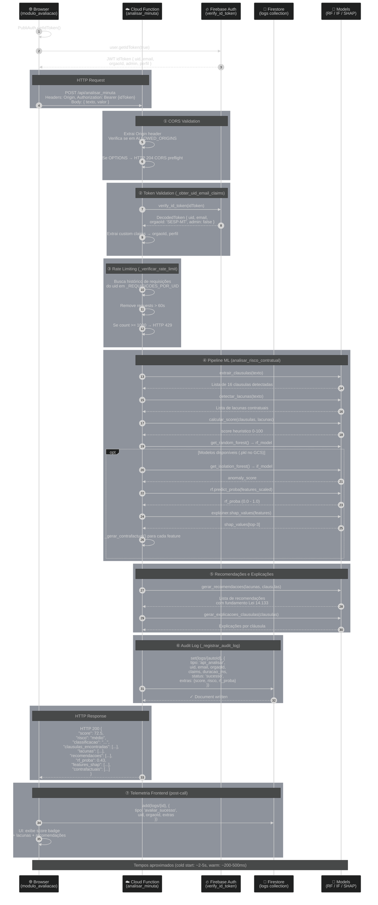

# Diagrama 06 — API Flow: Análise de Minuta (Sequence)

**Endpoint:** `POST /api/analisar_minuta` — Cloud Function Gen2 (Python 3.11)

```mermaid
%%{init: {'theme':'dark', 'themeVariables': {'primaryColor':'#1E293B','primaryTextColor':'#F1F5F9','primaryBorderColor':'#2EC4B6','lineColor':'#475569'}}}%%
sequenceDiagram
    autonumber
    participant B as 🌐 Browser<br/>(modulo_avaliacao)
    participant CF as ☁️ Cloud Function<br/>(analisar_minuta)
    participant FBA as 🔥 Firebase Auth<br/>(verify_id_token)
    participant FS as 📄 Firestore<br/>(logs collection)
    participant ML as 🤖 Models<br/>(RF / IF / SHAP)

    B->>B: PubliAuth.getIdToken()
    B->>FBA: user.getIdToken(true)
    FBA-->>B: JWT idToken { uid, email,<br/>orgaoId, admin, perfil }

    rect rgba(30,41,59,0.5)
        Note over B,CF: HTTP Request
        B->>CF: POST /api/analisar_minuta<br/>Headers: Origin, Authorization: Bearer {idToken}<br/>Body: { texto, valor }
    end

    rect rgba(30,41,59,0.5)
        Note over CF,FBA: ① CORS Validation
        CF->>CF: Extrai Origin header<br/>Verifica se em ALLOWED_ORIGINS
        CF->>CF: Se OPTIONS → HTTP 204 CORS preflight
    end

    rect rgba(30,41,59,0.5)
        Note over CF,FBA: ② Token Validation (_obter_uid_email_claims)
        CF->>FBA: verify_id_token(idToken)
        FBA-->>CF: DecodedToken { uid, email,<br/>orgaoId: 'SESP-MT', admin: false }
        CF->>CF: Extrai custom claims → orgaoId, perfil
    end

    rect rgba(30,41,59,0.5)
        Note over CF: ③ Rate Limiting (_verificar_rate_limit)
        CF->>CF: Busca histórico de requisições<br/>do uid em _REQUISICOES_POR_UID
        CF->>CF: Remove requests > 60s
        CF->>CF: Se count >= 1000 → HTTP 429
    end

    rect rgba(30,41,59,0.5)
        Note over CF,ML: ④ Pipeline ML (analisar_risco_contratual)
        CF->>ML: extrair_clausulas(texto)
        ML-->>CF: Lista de 16 clausulas detectadas
        CF->>ML: detectar_lacunas(texto)
        ML-->>CF: Lista de lacunas contratuais
        CF->>ML: calcular_score(clausulas, lacunas)
        ML-->>CF: score heuristico 0-100
        CF->>ML: get_random_forest() → rf_model
        opt Modelos disponíveis (.pkl no GCS)
            CF->>ML: get_isolation_forest() → if_model
            ML-->>CF: anomaly_score
            CF->>ML: rf.predict_proba(features_scaled)
            ML-->>CF: rf_proba (0.0 - 1.0)
            CF->>ML: explainer.shap_values(features)
            ML-->>CF: shap_values[top-3]
            CF->>CF: _gerar_contrafactual() para cada feature
        end
    end

    rect rgba(30,41,59,0.5)
        Note over CF,ML: ⑤ Recomendações e Explicações
        CF->>ML: gerar_recomendacoes(lacunas, clausulas)
        ML-->>CF: Lista de recomendações<br/>com fundamento Lei 14.133
        CF->>ML: gerar_explicacoes_clausulas(clausulas)
        ML-->>CF: Explicações por cláusula
    end

    rect rgba(30,41,59,0.5)
        Note over CF,FS: ⑥ Audit Log (_registrar_audit_log)
        CF->>FS: set(logs/{autoId}, {<br/>  tipo: 'api_analisar',<br/>  uid, email, orgaoId,<br/>  claims, duracao_ms,<br/>  status: 'sucesso',<br/>  extras: {score, risco, rf_proba}<br/>})
        FS-->>CF: ✓ Document written
    end

    rect rgba(30,41,59,0.5)
        Note over B,CF: HTTP Response
        CF-->>B: HTTP 200 {<br/>  "score": 72.5,<br/>  "risco": "médio",<br/>  "classificacao": "...",<br/>  "clausulas_encontradas": [...],<br/>  "lacunas": [...],<br/>  "recomendacoes": [...],<br/>  "rf_proba": 0.43,<br/>  "features_shap": [...],<br/>  "contrafactuais": [...]<br/>}
    end

    rect rgba(30,41,59,0.5)
        Note over B,FS: ⑦ Telemetria Frontend (post-call)
        B->>FS: add(logs/{id}, {<br/>  tipo: 'avaliar_sucesso',<br/>  uid, orgaoId, extras<br/>})
        B->>B: UI: exibe score badge<br/>+ lacunas + recomendações
    end

    Note over B,ML: Tempos aproximados (cold start: ~2-5s, warm: ~200-500ms)
```

**Tags de arquivo:** `docs/diagrams/06-api-analise.md`
